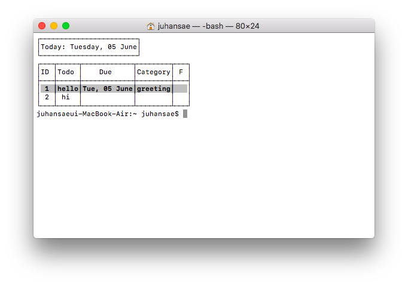

# Introduction : toclo
- toclo is a command line program which is about managing our schedule.

  It's name 'toclo' means 'todo'. (cl = d)

  You can manage your schedule such as adding, modifying, searching your schedule by entering some commands that this program offers you.

  This program is developed based on Python 3 and is easily available to anyone
  who wants to use the app.

  It is also made in a form of Python Package.

  If you want to manage your schedule efficiently, I want to recommend this program to you.

# Requirements
- This program needs:
  - Python 3.x
  - Windows, Linux, Mac OS X

# Installation
  - It's very simple. Execute the command prompt and enter the command like below:

     `pip install toclo`

  - If you want to update the new version of this program, you have to follow steps below:

     `pip uninstall toclo`
     
     `pip install toclo`

# Usage
  - If you install the package into your computer, you can use the program like this:

    `toclo [commands]`

    This program contains these commands:

    `--h, --help` : You can see the manual that defines how to enter commands to use this program.

    `--version` : You can check the program's version.

    `add` : You can add your schedule into this program.

    `ls` : You can see your schedules that you entered before.

    `modify` : You can change your schedule.

    `delete` : You can erase your schedule.

    `complete` : If there exists a finished schedule, you can directly change the finish status of your schedule.

    ## commands

      ### add
      Format : `toclo add <what> <due> [<category>]`

      If the category column is empty, the schedule will be seen with the category blanked.
      If you don't want to set due, input x instead of 'YYYY-MM-DD'

      Example :

      `toclo add Assignment 2018-06-03`

      `toclo add Sleep 2018-06-04 Life`

      `toclo add Study x Life`

      ### ls
      Format : `toclo ls [<category> <done> <all>]`

      If you enter the default command `toclo ls`, You can see your schedules that are not finished.

      If you enter the command `toclo ls <category>`, you can see schedules for the category that you entered.

      If you enter the command `toclo ls <done>`, you can see the schedules that already finished.

      If you want to see your all schedules including finished/unfinished, you should enter the command `toclo ls all`.

      Example :

      `toclo ls`

      `toclo ls all`

      `toclo ls Life`

      `toclo ls done`

      `toclo ls Life done`

      * If the schedule's due is passed comparing to the current date, that schedule may be seen highlighted.

      ### modify
      Format : `toclo modify <id> <what> <due> <category> <v>`

      When you use this command, if the content is same as before, you should enter `-`.

      Example :

      `toclo modify 3 Homework 2018-06-05 work 1`

      `toclo modify 1 - 2018-06-03 - -`

      ### delete
      Format : `toclo delete (<id> | <all>)`

      When you entered `toclo delete <id>`, only schedules with this id will be deleted.

      However, when you entered `toclo delete <all>`, all schedules will be deleted.

      Example :

      `toclo delete 2`

      `toclo delete all`

      ### complete
      Format : `toclo complete <id>`

      When you entered like above, the schedule with that id's finish category will be checked.

      It means that schedule is finished.

      Example :

      `toclo complete 3`

    ## Convenience Features

    ### Due

      When you 'add' or 'modify', you have to input 'due' such as ''YYYY-MM-DD'.

      # <due>

      When you 'add' or 'modify', you have to input '<due>' such as ''YYYY-MM-DD'.
      Instead of typing long like above, you can just input number 0 ~ 7.
      'due' will be saved in 'today after number days'.
      For example, if number is 0, due will be today. If number is 1, due will be tomorrow.

      Example:

      `toclo add "Finish assignment" 1 Study`

      `toclo modify 1 - 0 -`

    ### Highlight

      If a todo's due is over or today, that low is highlighted.
      

    * If you entered the wrong command or the input format is incorrect, this program will open the help window automatically to make you understand the correct usage.

- If you want more information, please contact us through the github.
